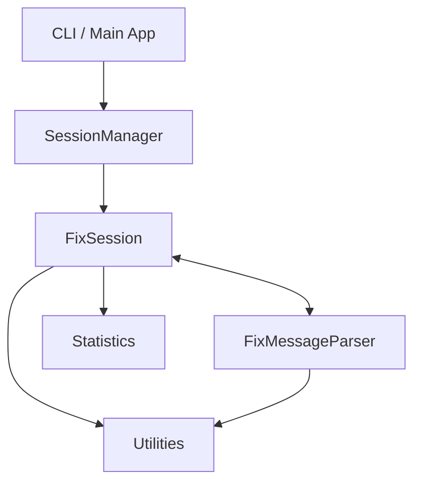

# Fixit Protocol Test Harness

A modern, modular, and extensible test harness for the FIX (Financial Information eXchange) protocol. Fixit is designed for developers, testers, and QA engineers who need to validate, simulate, and analyze FIX message flows in trading and financial systems.

## Features

- **FIX Message Parsing**: Robust parser for FIX messages with validation and error handling.
- **Session Management**: Manage multiple FIX sessions, including connection, disconnection, and state tracking.
- **Statistics & Reporting**: Generate message statistics and type breakdowns for analysis.
- **Configurable**: Load configuration from YAML or JSON files for flexible test setups.
- **Pretty Printing**: Human-readable output for FIX messages.
- **Admin Message Handling**: Special handling for logon, logout, and heartbeat messages.
- **Protocol Versioning**: Support for multiple FIX protocol versions.
- **Feature Toggles**: Enable/disable features like encryption, logging, and more.
- **Extensible**: Modular codebase for easy extension and integration.

## Architecture

```
+-------------------+
|  CLI / Main App   |
+-------------------+
          |
          v
+-------------------+
|   SessionManager  |<-------------------+
+-------------------+                    |
          |                              |
          v                              |
+-------------------+         +-------------------+
|   FixSession      |<------->|  FixMessageParser |
+-------------------+         +-------------------+
          |                              |
          v                              v
+-------------------+         +-------------------+
|   Statistics      |         |   Utilities       |
+-------------------+         +-------------------+
```

- **CLI / Main App**: Entry point for running tests, simulations, and utilities.
- **SessionManager**: Manages multiple FIX sessions, their lifecycle, and configuration.
- **FixSession**: Handles individual session logic, message send/receive, admin messages, and state.
- **FixMessageParser**: Parses and validates FIX messages.
- **Statistics**: Collects and reports message statistics.
- **Utilities**: Helpers for config loading, pretty-printing, and filtering.

## Architecture Diagram



## Usage Example

```python
from fixit.core import FixMessageParser
from fixit.session import FixSession

parser = FixMessageParser()
msg = parser.parse("8=FIX.4.2|9=12|35=A|49=CLIENT|56=SERVER|10=123|")
if parser.validate(msg):
    print("Valid FIX message!", msg)

session = FixSession("session-1", config={"host": "localhost", "port": 9876})
session.connect()
session.send_message("8=FIX.4.2|9=12|35=A|49=CLIENT|56=SERVER|10=123|")
session.disconnect()
```

## Getting Started

1. Clone the repository.
2. Install dependencies (see requirements.txt).
3. Run your test harness or scripts.

## Contributing

See [CONTRIBUTING.md](CONTRIBUTING.md) for guidelines.

## License

MIT License. See [LICENSE](LICENSE) for details.

## Changelog

See [CHANGELOG.md](CHANGELOG.md) for release history.